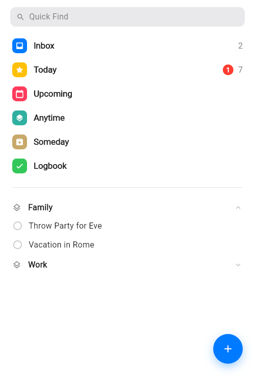
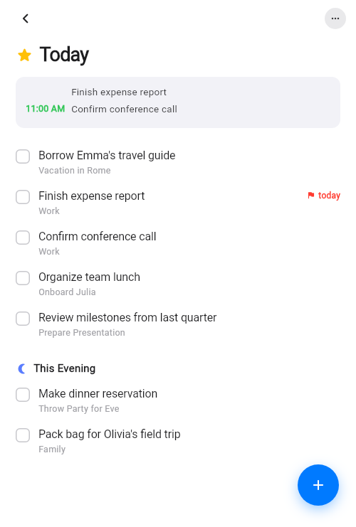
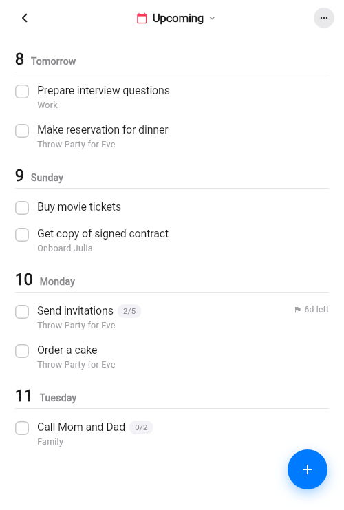
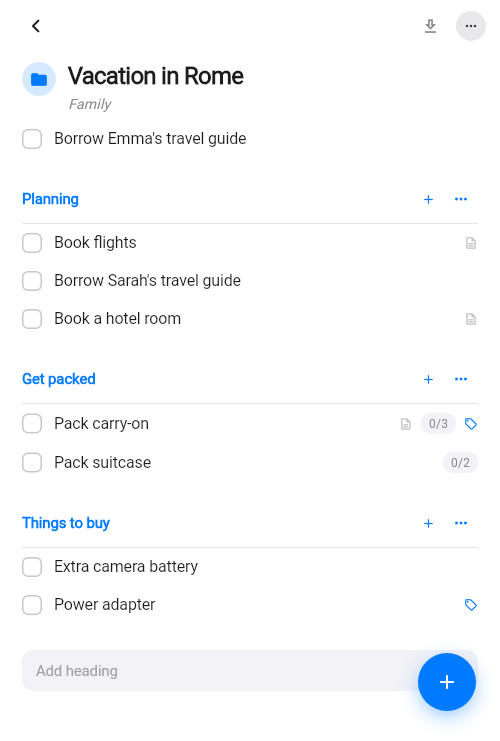
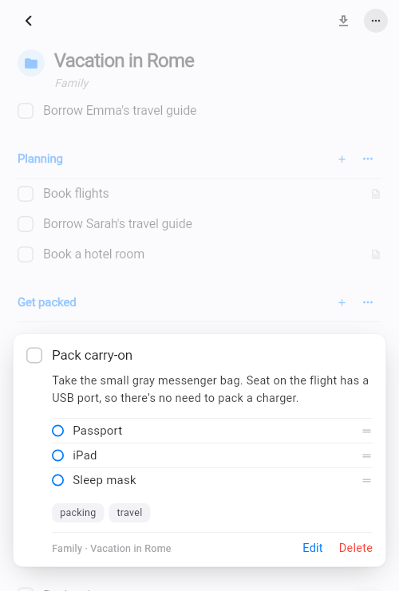
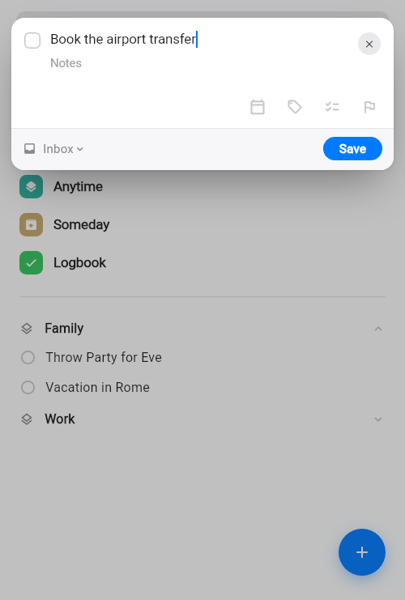
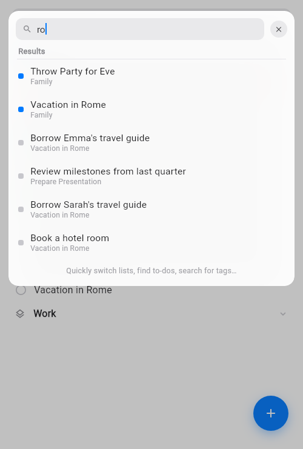
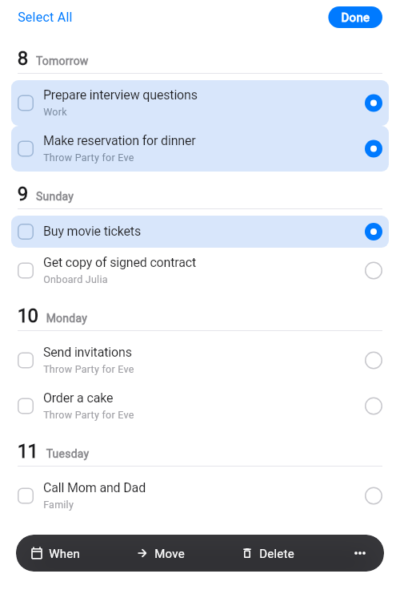

# TaskFlow

**A task manager built around one idea: a list you can read at a glance.**

Rows stay one line no matter how much a task is carrying. Sections are a
heading over a hairline rather than a card. Opening a task expands it in
place instead of pushing a new screen — so you never lose your position in
the list you were reading.

Flutter · one codebase for Android, iOS and web · offline-first.

---

## The app

|  |  |
| :--: | :--: |
|  |  |
| **Home** — six lists, then your own areas and projects. Counts appear only where they earn their place. | **Today** — what's happening, what's due, and a separate *This Evening*. |
|  |  |
| **Upcoming** — scheduled work grouped by day, with checklist progress and deadlines inline. | **Projects** — divided into headings you name, with completion rings and to-dos you can drag between sections. |
|  |  |
| **Open in place** — notes, checklist and tags expand where the row was, the rest of the list dimmed. | **Quick capture** — opens over whatever you were doing and returns you there. |
|  |  |
| **Quick Find** — jump to any list, project, to-do or tag. | **Multi-select** — long-press, then reschedule, move or delete a batch. |

---

## What it does

**Six lists that mean something.** Inbox for anything caught without a
decision. Today for the work in front of you. Upcoming, grouped by day.
Anytime for live work with no date, Someday for what's deliberately parked,
and a Logbook of everything finished.

**Structure when you want it.** Areas hold projects, projects divide into
headings you name. Drag a to-do between sections; rename a heading and its
to-dos follow.

**Capture without stopping.** `Ctrl/Cmd+N` from anywhere on Home. Type
*"call the dentist tomorrow"*, *"send invoice next friday"*, or *"water the
plants every friday"* and the date, and the repeat, are understood from the
sentence.

**The details that make a to-do real.** Notes, checklists, free-form tags, a
scheduled date and a separate deadline. Finish something recurring and its
next occurrence is written with a fresh checklist.

Light and dark follow the system setting.

---

## Engineering highlights

**A design system, in code.** Colour, elevation and a full type scale live in
one file as a themed extension that resolves light and dark, so every screen
reads from the same source rather than hard-coding values. The type scale
converts the design's CSS `em` letter-spacing into logical pixels at each
size.

**UI primitives built, not assembled.** The checkbox, section header, project
completion ring and task row are purpose-built widgets — the ring is a
`CustomPainter` — rather than stock Material components bent into shape. Hit
targets are enlarged without disturbing layout, so rows stay aligned to the
gutter while staying comfortable to tap.

**Offline-first storage with real migrations.** SQLite through eight schema
versions, each upgrade preserving what's already on the device. The newest
adds project headings, and takes care that a database upgrading from an older
version doesn't collide with a column it already has.

**Built to be testable.** The state layer depends on a storage *interface*
rather than the database directly, which lets the suite drive the whole
provider against an in-memory store. 40 tests cover serialisation, state
transitions and the date parser. `flutter analyze` reports zero issues.

**Reproducible deploys.** The build pins its SDK version and caches it between
runs, re-downloading whenever the pin moves — so a build that passes locally
passes in CI for the same reasons.

---

## Stack

| | |
| --- | --- |
| **Framework** | Flutter 3.44 / Dart 3.12 |
| **State** | `provider`, with storage behind an interface |
| **Storage** | SQLite (`sqflite`), versioned migrations |
| **Targets** | Android, iOS, web |
| **Testing** | `flutter_test`, 40 tests |
| **Deploy** | Vercel, pinned-toolchain build script |

---

## Running it

```bash
flutter pub get
flutter run          # a connected device, or -d chrome
flutter test
```

Requires Flutter 3.44.8 — the version the deploy script installs, so local and
production builds resolve identically.

> The web build keeps data in memory: `sqflite` has no browser backend, so a
> reload starts fresh. Android and iOS persist to disk.

## Layout

```
lib/
  design/       palette, light/dark theme extension, type scale
  models/       Task, Area, Project
  providers/    app state over a storage interface
  services/     SQLite, storage interface, date parsing
  screens/      home, lists, project detail, capture, find
  widgets/      shared primitives
test/           in-memory store plus model, state and parser tests
```
